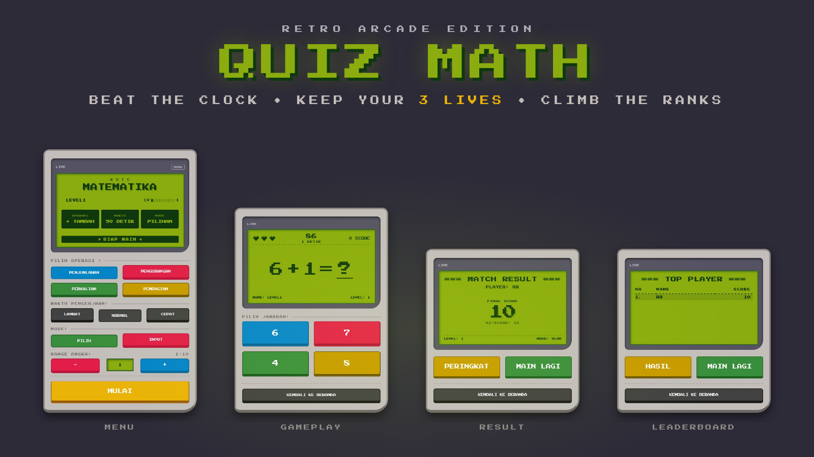
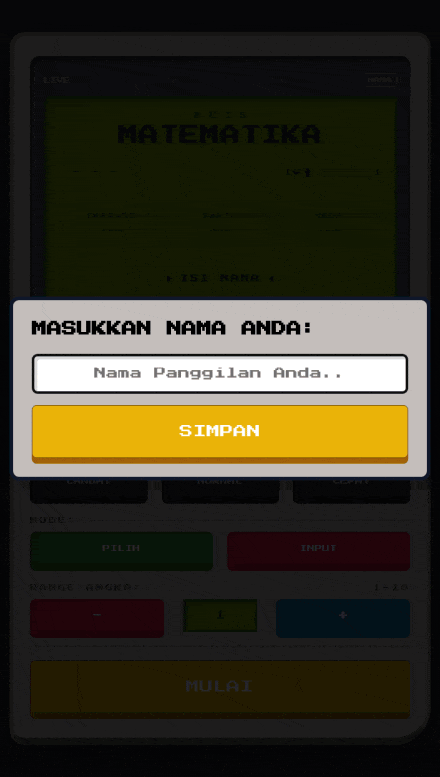
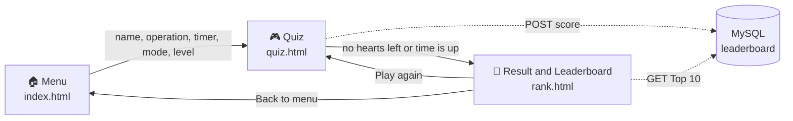

<div align="center">

🌐 [Bahasa Indonesia](README.md) &nbsp;·&nbsp; **English**



<br><br>

**A fast-paced math quiz wrapped in a nostalgic Game Boy-inspired interface.**<br>
Test your mental math speed, climb the dynamic leaderboards, and secure your absolute best high score across multiple difficulty levels and time constraints!

<br>


<br>

[Gameplay](#-gameplay) &nbsp;·&nbsp; [Features](#-features) &nbsp;·&nbsp; [How to Play](#-how-to-play) &nbsp;·&nbsp; [How It Works](#-how-it-works) &nbsp;·&nbsp; [Tech Stack](#-tech-stack) &nbsp;·&nbsp; [Database](#-database-schema) &nbsp;·&nbsp; [Getting Started](#-getting-started)

<br>

|    **4**    |      **3**      |    **10**    |    **3**    |
| :---------: | :-------------: | :----------: | :---------: |
| Operations  |  Timer speeds   |    Levels    |    Lives    |

</div>

<br>

## 🎬 Gameplay

<table>
  <tr>
    <td width="40%" align="center" valign="top">
      
      <br>
      <sub>A real match, recorded from the game itself.</sub>
    </td>
    <td valign="middle">
      <h3>A full match, step by step</h3>
      <ol>
        <li>
          <b>Set up your match.</b> Enter your name, then pick an <b>operation</b>, <b>timer speed</b>, <b>answer mode</b> and <b>level</b>. The green LCD fills in as you choose, and the status line switches to <code>SIAP MAIN</code> (ready) when everything is set.
          <br><br>
        </li>
        <li>
          <b>Beat the clock.</b> Three hearts, a match countdown, and a 5-second limit on every question. Each correct answer is worth <b>+5</b>. A wrong answer or a timeout costs you a heart.
          <br><br>
        </li>
        <li>
          <b>Game over.</b> When your hearts run out (or the match timer hits zero) the screen flashes <code>GAME OVER!!</code> while your score is saved.
          <br><br>
        </li>
        <li>
          <b>Check your result.</b> See your final score, personal hi-score, and the level and timer mode of the match. Flip to the leaderboard with <b>Peringkat</b>, or jump straight back in with <b>Main Lagi</b>.
          <br><br>
        </li>
        <li>
          <b>Climb the ranks.</b> The <b>Top 10</b> for your exact level and timer combination. Your row is highlighted, and if you're outside the Top 10 your rank stays pinned at the bottom.
        </li>
      </ol>
    </td>
  </tr>
</table>

<br>

## 🎮 Features

- **Retro UI/UX design.** A fully responsive, CSS-built arcade interface with the 8-bit *Press Start 2P* font, screen-flash and blink animations, and a classic green LCD look.
- **Highly customizable matches.**
    - **4 operations:** addition (+), subtraction (−), multiplication (×) and division (÷).
    - **3 timer speeds:** Slow (120 s), Normal (90 s) and Fast (60 s).
    - **2 play modes:** multiple choice (4 options) or manual keyboard input.
    - **Dynamic difficulty:** scale the size of the numbers by adjusting the level from 1 to 10.
- **Smart dynamic leaderboard.**
    - Scores are strictly categorized by **level** and **timer speed**, so every combination has its own fair competition.
    - A smart *upsert* (`ON DUPLICATE KEY UPDATE`) only overwrites your score when you beat your previous high score in that category.
    - Your name is highlighted automatically when you make it into the Top 10.
    - If you haven't cracked the Top 10 yet, your own rank is pinned at the bottom of the board.
- **Health system.** 3 hearts per game, plus a 5-second limit on every question. A wrong answer or a timeout costs you a heart.
- **Live menu screen.** The LCD mirrors your choices as you make them, and a status line guides you until the match is ready to start.
- **Play again in one tap.** *Main Lagi* restarts with the exact same settings.

<br>

## 🎯 How to Play

| Rule | Details |
| :--- | :--- |
| **Score** | +5 points for every correct answer |
| **Lives** | 3 hearts. A wrong answer or a timeout takes one away |
| **Question timer** | 5 seconds per question |
| **Match timer** | Slow 120 s · Normal 90 s · Fast 60 s |
| **Game over** | When your hearts run out or the match timer hits 0 |
| **Level** | Higher level means larger numbers (1 to 10) |
| **Division** | Always produces whole-number answers |

<br>

## 🔁 How It Works



When a match ends, the score is sent to the PHP API. The result page then asks the API for the Top 10 of that match's **level + timer** category and your own rank within it.

<br>

## 🧰 Tech Stack

| Layer | Technologies |
| :--- | :--- |
| **Frontend** | HTML5, CSS3 (Flexbox / Grid, custom variables, keyframe animations), Vanilla JavaScript (DOM manipulation, Fetch API) |
| **Backend** | PHP 8+ (RESTful JSON API, prepared statements to prevent SQL injection) |
| **Database** | MySQL / MariaDB |
| **Deployment** | InfinityFree hosting, automated CI/CD via GitHub Actions |
| **Font** | [Press Start 2P](https://fonts.google.com/specimen/Press+Start+2P) |

<br>

## 💾 Database Schema

The core of the leaderboard is a table designed to prevent duplicate player entries per category.

```sql
CREATE TABLE `leaderboard` (
  `id` int(255) NOT NULL AUTO_INCREMENT,
  `nama` varchar(50) NOT NULL,
  `score` int(11) NOT NULL,
  `level` int(11) NOT NULL,
  `timer` varchar(10) NOT NULL DEFAULT 'normal',
  `create_at` timestamp NOT NULL DEFAULT current_timestamp(),
  PRIMARY KEY (`id`),
  UNIQUE KEY `kunci_unik_pemain` (`nama`,`level`,`timer`)
) ENGINE=InnoDB DEFAULT CHARSET=utf8mb4;
```

| Column | Description |
| :--- | :--- |
| `nama` | Player name |
| `score` | Best score of that player in the category |
| `level` | Level played (1 to 10) |
| `timer` | Timer speed: `slow`, `normal` or `fast` |
| `create_at` | When the row was created |

**One row per player, per category.** The unique key `(nama, level, timer)` guarantees a player appears only once on each board. Saving a score is a single upsert that only keeps the higher value (simplified):

```sql
INSERT INTO leaderboard (nama, score, level, timer)
VALUES (?, ?, ?, ?)
ON DUPLICATE KEY UPDATE score = GREATEST(score, VALUES(score));
```

Reading a board is a plain filter on the same two columns (simplified):

```sql
SELECT nama, score
FROM leaderboard
WHERE level = ? AND timer = ?
ORDER BY score DESC, id ASC
LIMIT 10;
```

<br>

## 📂 Project Structure

```text
quiz-math/
├── index.html          # Menu: name, operation, timer, mode, level
├── quiz.html           # Gameplay screen
├── rank.html           # Match result and leaderboard
├── style.css           # Game Boy UI, animations, LCD styling
├── script.js           # Game logic, timers, hearts, API calls
├── assets/             # Heart sprites, banner and demo GIF
├── database/
│   └── api.php         # JSON API: save a score / read the leaderboard
└── .github/workflows/  # CI/CD pipeline (GitHub Actions)
```

<br>

## 🚀 Getting Started

**Requirements:** a local PHP 8+ and MySQL/MariaDB stack, such as [XAMPP](https://www.apachefriends.org/).

1. **Get the code.** Clone the repository into your web root (for XAMPP, the `htdocs` folder).
    ```bash
    git clone https://github.com/<your-username>/quiz-math.git
    ```
2. **Create the database.** In phpMyAdmin, create a database named `db_math_quiz` and run the SQL from [Database Schema](#-database-schema).
3. **Check the connection.** Make sure the host, username, password and database name at the top of `database/api.php` match your setup.
4. **Play.** Start *Apache* and *MySQL*, then open `http://localhost/quiz-math/`.

> [!NOTE]
> Open the game through a web server (`http://localhost/...`), not by double-clicking the HTML files. The leaderboard needs the PHP API to work.

<br>

## 🙏 Credits

- Font: [Press Start 2P](https://fonts.google.com/specimen/Press+Start+2P) by CodeMan38, licensed under the SIL Open Font License.

<br>

<div align="center">

**Press START to play.** 🕹

</div>
