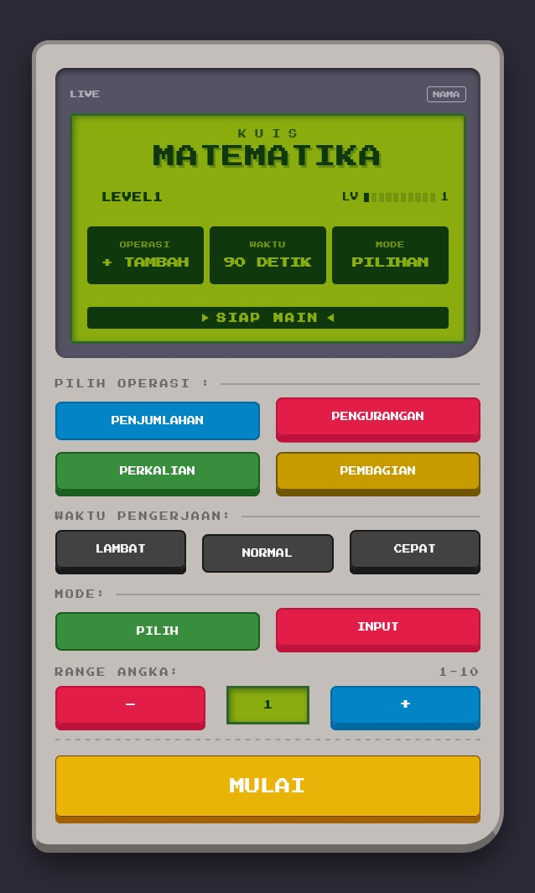
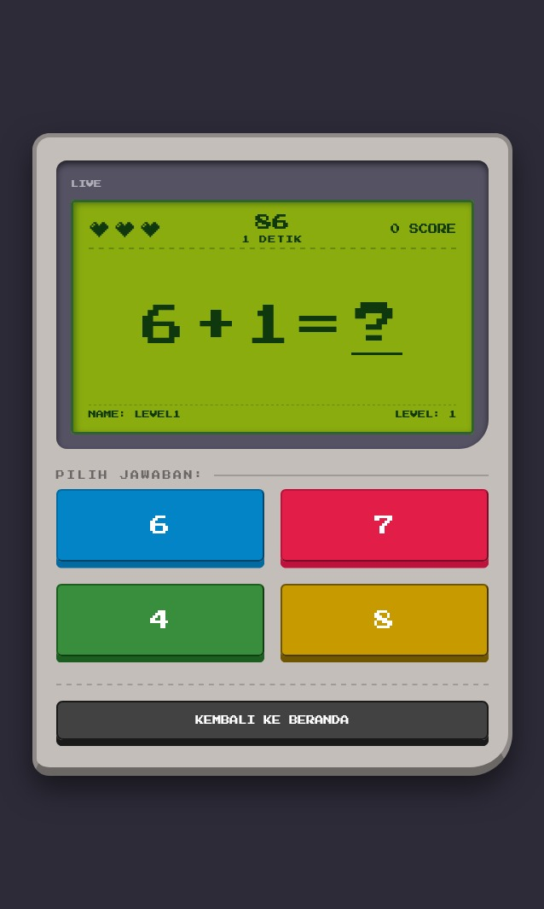
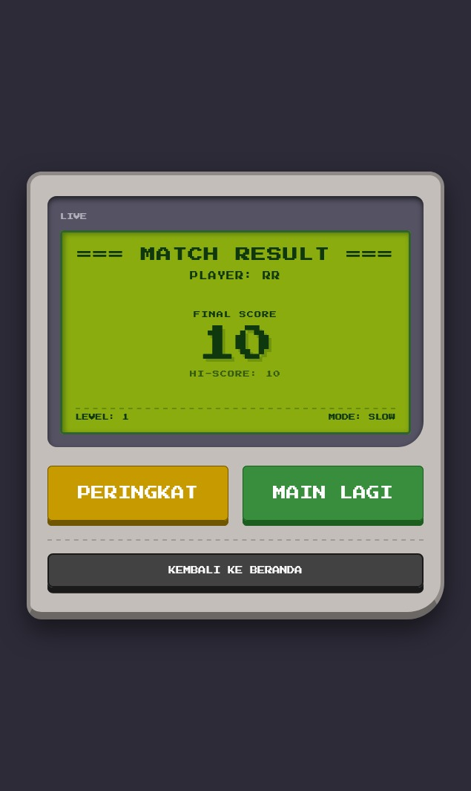
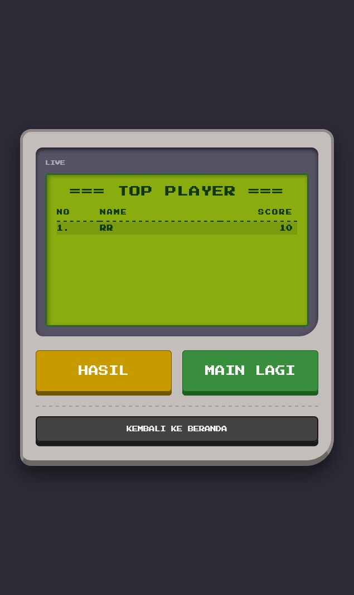

# Quiz Math - Retro Arcade Edition

A fast-paced, web-based mathematics quiz game wrapped in a nostalgic Game Boy-inspired interface. Test your mental math speed, climb the dynamic leaderboards, and secure your absolute best high score across multiple difficulty levels and time constraints!

 
 

## 🎮 Features

*   **Retro UI/UX Design:** A fully responsive, CSS-styled arcade interface featuring 8-bit fonts (`Press Start 2P`), screen-flash animations, and a classic green LCD aesthetic.
*   **Highly Customizable Matches:** 
    *   **4 Operations:** Addition (+), Subtraction (-), Multiplication (x), and Division (/).
    *   **3 Timer Speeds:** Slow (120s), Normal (90s), and Fast (60s).
    *   **2 Play Modes:** Multiple Choice (4 options) or Manual Keyboard Input.
    *   **Dynamic Difficulty:** Scale the range of numbers by adjusting the Level from 1 to 10.
*   **Smart Dynamic Leaderboard:** 
    *   Scores are strictly categorized by **Level** and **Timer Speed**, ensuring fair competition.
    *   Utilizes a smart "Upsert" database logic (`ON DUPLICATE KEY UPDATE`): the system only overwrites your score if you beat your previous high score in that specific category.
    *   Automatically highlights your name if you make it to the Top 10.
    *   Displays your latest match result at the bottom of the leaderboard if you haven't cracked the Top 10 yet.
*   **Health & Combo System:** 3 lives per game. Answer quickly to build your score, but a timeout or a wrong answer will cost you a life!




## 🛠️ Tech Stack

*   **Frontend:** HTML5, CSS3 (Flexbox/Grid, Custom Variables, Keyframe Animations), Vanilla JavaScript (DOM Manipulation, Fetch API).
*   **Backend:** PHP 8+ (RESTful JSON API, Prepared Statements for SQL Injection prevention).
*   **Database:** MySQL / MariaDB.
*   **Deployment:** InfinityFree Hosting & Automated CI/CD via GitHub Actions.

## 🗄️ Database Schema

The core of the leaderboard relies on a specific table structure designed to prevent duplicate player entries per category. 

```sql
CREATE TABLE `leaderboard` (
  `id` int(255) NOT NULL AUTO_INCREMENT,
  `nama` varchar(50) NOT NULL,
  `score` int(11) NOT NULL,
  `level` int(11) NOT NULL,
  `timer` varchar(10) NOT NULL DEFAULT 'normal',
  `create_at` timestamp NOT NULL DEFAULT current_timestamp(),
  PRIMARY KEY (`id`),
  UNIQUE KEY `kunci_unik_pemain` (`nama`,`level`,`timer`)
) ENGINE=InnoDB DEFAULT CHARSET=utf8mb4;