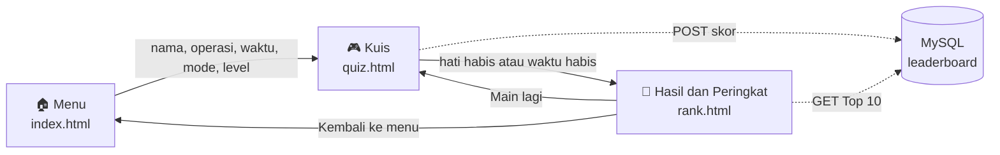

<div align="center">

🌐 **Bahasa Indonesia** &nbsp;·&nbsp; [English](README.en.md)


<br><br>

**Kuis matematika serba cepat dalam balutan antarmuka bergaya Game Boy yang nostalgik.**<br>
Uji kecepatan hitungmu, panjat papan peringkat yang dinamis, dan amankan skor tertinggimu di berbagai level kesulitan dan batas waktu!

<br>


<br>

[Gameplay](#-gameplay) &nbsp;·&nbsp; [Fitur](#-fitur) &nbsp;·&nbsp; [Cara Bermain](#-cara-bermain) &nbsp;·&nbsp; [Cara Kerja](#-cara-kerja) &nbsp;·&nbsp; [Teknologi](#-teknologi) &nbsp;·&nbsp; [Database](#-skema-database) &nbsp;·&nbsp; [Cara Menjalankan](#-cara-menjalankan)

<br>

|     **4**     |       **3**        |    **10**    |    **3**    |
| :-----------: | :----------------: | :----------: | :---------: |
|    Operasi    |  Kecepatan waktu   |    Level     |    Nyawa    |

</div>

<br>

## 🎬 Gameplay

<table>
  <tr>
    <td width="40%" align="center" valign="top">
      
      <br>
      <sub>Satu pertandingan sungguhan, direkam langsung dari game-nya.</sub>
    </td>
    <td valign="middle">
      <h3>Satu pertandingan penuh, langkah demi langkah</h3>
      <ol>
        <li>
          <b>Atur pertandinganmu.</b> Masukkan nama, lalu pilih <b>operasi</b>, <b>kecepatan waktu</b>, <b>mode jawaban</b>, dan <b>level</b>. Layar LCD hijau terisi seiring pilihanmu, dan baris status berubah menjadi <code>SIAP MAIN</code> saat semuanya sudah siap.
          <br><br>
        </li>
        <li>
          <b>Kejar waktu.</b> Tiga hati, hitung mundur pertandingan, dan batas 5 detik untuk setiap soal. Tiap jawaban benar bernilai <b>+5</b>. Jawaban salah atau kehabisan waktu mengurangi satu hati.
          <br><br>
        </li>
        <li>
          <b>Game over.</b> Saat hatimu habis (atau waktu pertandingan berakhir), layar berkedip <code>GAME OVER!!</code> sementara skormu disimpan.
          <br><br>
        </li>
        <li>
          <b>Lihat hasilmu.</b> Cek skor akhir, hi-score pribadi, serta level dan mode waktu pertandingan. Pindah ke papan peringkat dengan <b>Peringkat</b>, atau langsung main lagi dengan <b>Main Lagi</b>.
          <br><br>
        </li>
        <li>
          <b>Panjat peringkat.</b> <b>Top 10</b> untuk kombinasi level dan waktu yang sama persis. Barismu disorot, dan kalau kamu di luar Top 10, peringkatmu tetap disematkan di bagian bawah.
        </li>
      </ol>
    </td>
  </tr>
</table>

<br>

## 🎮 Fitur

- **Desain UI/UX retro.** Antarmuka arcade yang sepenuhnya responsif, dibangun dengan CSS, memakai font 8-bit *Press Start 2P*, animasi layar berkedip, dan tampilan LCD hijau klasik.
- **Pertandingan yang bisa diatur sesukamu.**
    - **4 operasi:** penjumlahan (+), pengurangan (−), perkalian (×), dan pembagian (÷).
    - **3 kecepatan waktu:** Lambat (120 detik), Normal (90 detik), dan Cepat (60 detik).
    - **2 mode bermain:** pilihan ganda (4 opsi) atau mengetik jawaban lewat keyboard.
    - **Kesulitan dinamis:** atur besar angka soal dengan mengubah level dari 1 sampai 10.
- **Papan peringkat dinamis yang cerdas.**
    - Skor dikelompokkan secara ketat berdasarkan **level** dan **kecepatan waktu**, sehingga setiap kombinasi punya persaingan yang adil.
    - *Upsert* pintar (`ON DUPLICATE KEY UPDATE`) hanya menimpa skormu kalau kamu berhasil mengalahkan rekor sebelumnya di kategori itu.
    - Namamu otomatis disorot saat berhasil masuk Top 10.
    - Kalau belum masuk Top 10, peringkatmu sendiri disematkan di bagian bawah papan.
- **Sistem nyawa.** 3 hati per permainan, ditambah batas 5 detik untuk setiap soal. Jawaban salah atau kehabisan waktu mengurangi satu hati.
- **Layar menu yang hidup.** LCD menampilkan pilihanmu secara langsung, dan baris status memandu sampai pertandingan siap dimulai.
- **Main lagi dalam sekali tekan.** *Main Lagi* mengulang pertandingan dengan pengaturan yang persis sama.

<br>

## 🎯 Cara Bermain

| Aturan | Keterangan |
| :--- | :--- |
| **Skor** | +5 poin untuk setiap jawaban benar |
| **Nyawa** | 3 hati. Jawaban salah atau kehabisan waktu mengurangi satu hati |
| **Waktu per soal** | 5 detik untuk setiap soal |
| **Waktu pertandingan** | Lambat 120 detik · Normal 90 detik · Cepat 60 detik |
| **Game over** | Saat hati habis atau waktu pertandingan mencapai 0 |
| **Level** | Makin tinggi level, makin besar angkanya (1 sampai 10) |
| **Pembagian** | Selalu menghasilkan jawaban bilangan bulat |

<br>

## 🔁 Cara Kerja



Saat pertandingan selesai, skor dikirim ke API PHP. Halaman hasil kemudian meminta API untuk menampilkan Top 10 pada kategori **level + waktu** pertandingan itu, beserta peringkatmu di dalamnya.

<br>

## 🧰 Teknologi

| Lapisan | Teknologi |
| :--- | :--- |
| **Frontend** | HTML5, CSS3 (Flexbox / Grid, variabel kustom, animasi keyframe), Vanilla JavaScript (manipulasi DOM, Fetch API) |
| **Backend** | PHP 8+ (RESTful JSON API, prepared statement untuk mencegah SQL injection) |
| **Database** | MySQL / MariaDB |
| **Deployment** | Hosting InfinityFree, CI/CD otomatis dengan GitHub Actions |
| **Font** | [Press Start 2P](https://fonts.google.com/specimen/Press+Start+2P) |

<br>

## 💾 Skema Database

Inti dari papan peringkat adalah sebuah tabel yang dirancang agar tidak ada pemain ganda di tiap kategori.

```sql
CREATE TABLE `leaderboard` (
  `id` int(255) NOT NULL AUTO_INCREMENT,
  `nama` varchar(50) NOT NULL,
  `score` int(11) NOT NULL,
  `level` int(11) NOT NULL,
  `timer` varchar(10) NOT NULL DEFAULT 'normal',
  `create_at` timestamp NOT NULL DEFAULT current_timestamp(),
  PRIMARY KEY (`id`),
  UNIQUE KEY `kunci_unik_pemain` (`nama`,`level`,`timer`)
) ENGINE=InnoDB DEFAULT CHARSET=utf8mb4;
```

| Kolom | Keterangan |
| :--- | :--- |
| `nama` | Nama pemain |
| `score` | Skor terbaik pemain itu di kategori tersebut |
| `level` | Level yang dimainkan (1 sampai 10) |
| `timer` | Kecepatan waktu: `slow`, `normal`, atau `fast` |
| `create_at` | Waktu baris dibuat |

**Satu baris per pemain, per kategori.** Unique key `(nama, level, timer)` memastikan seorang pemain hanya muncul satu kali di setiap papan. Menyimpan skor cukup dengan satu upsert yang hanya mempertahankan nilai tertinggi (disederhanakan):

```sql
INSERT INTO leaderboard (nama, score, level, timer)
VALUES (?, ?, ?, ?)
ON DUPLICATE KEY UPDATE score = GREATEST(score, VALUES(score));
```

Membaca satu papan cukup dengan menyaring dua kolom yang sama (disederhanakan):

```sql
SELECT nama, score
FROM leaderboard
WHERE level = ? AND timer = ?
ORDER BY score DESC, id ASC
LIMIT 10;
```

<br>

## 📂 Struktur Proyek

```text
quiz-math/
├── index.html          # Menu: nama, operasi, waktu, mode, level
├── quiz.html           # Layar permainan
├── rank.html           # Hasil pertandingan dan papan peringkat
├── style.css           # Antarmuka Game Boy, animasi, tampilan LCD
├── script.js           # Logika game, timer, nyawa, pemanggilan API
├── assets/             # Sprite hati, banner, dan GIF demo
├── database/
│   └── api.php         # API JSON: simpan skor / baca papan peringkat
└── .github/workflows/  # Pipeline CI/CD (GitHub Actions)
```

<br>

## 🚀 Cara Menjalankan

**Kebutuhan:** PHP 8+ dan MySQL/MariaDB di komputermu, misalnya lewat [XAMPP](https://www.apachefriends.org/).

1. **Ambil kodenya.** Clone repositori ke folder web server (untuk XAMPP, folder `htdocs`).
    ```bash
    git clone https://github.com/<username-kamu>/quiz-math.git
    ```
2. **Buat database.** Di phpMyAdmin, buat database bernama `db_math_quiz` lalu jalankan SQL dari bagian [Skema Database](#-skema-database).
3. **Cek koneksi.** Pastikan host, username, password, dan nama database di bagian atas `database/api.php` sesuai dengan pengaturanmu.
4. **Mainkan.** Jalankan *Apache* dan *MySQL*, lalu buka `http://localhost/quiz-math/`.

> [!NOTE]
> Buka game lewat web server (`http://localhost/...`), jangan dengan klik dua kali file HTML-nya. Papan peringkat membutuhkan API PHP agar bisa berfungsi.

<br>

## 🙏 Kredit

- Font: [Press Start 2P](https://fonts.google.com/specimen/Press+Start+2P) oleh CodeMan38, berlisensi SIL Open Font License.

<br>

<div align="center">

**Tekan START untuk bermain.** 🕹

</div>